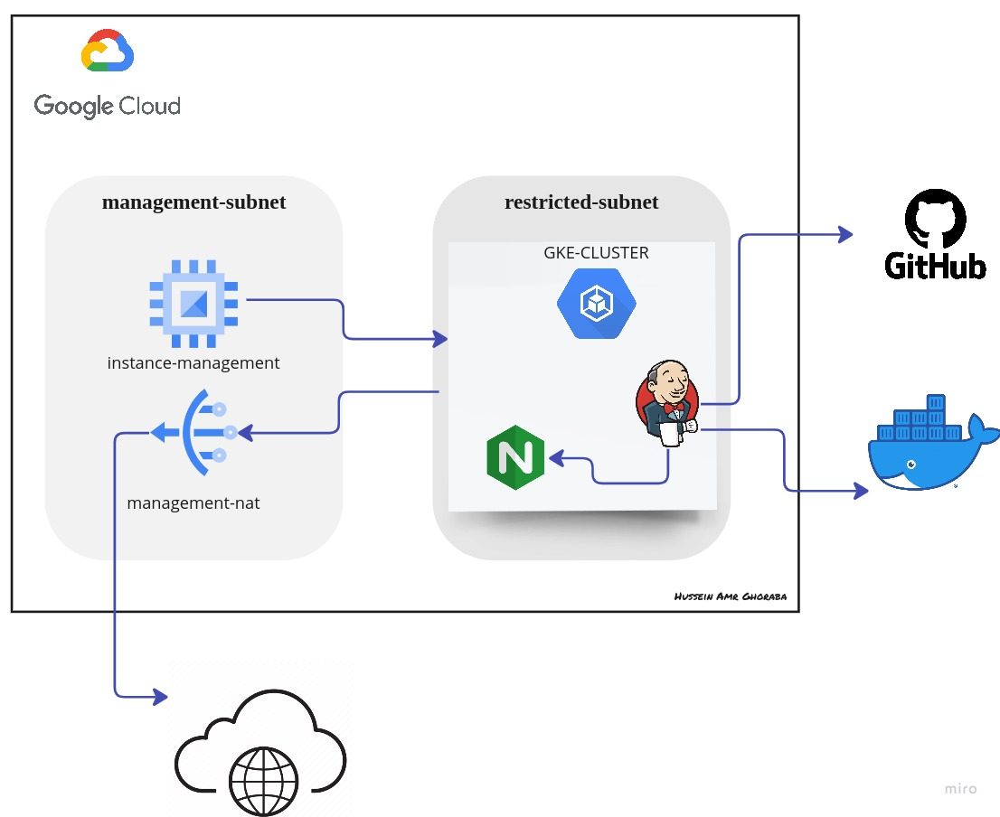

# $${\color{blue}GCP-Infrastructure-of-Final-ITI-Project}$$	
## A brief about the infrastructure of the project:
**Infrastructure of the project will be deployed using `Terraform files` and will create resources as following:**

***1-`VPC` with name `vpc-main` that contains: `management-Subnet` and `restricted-subnet`***

***2-`management-subnet` contains: `VM-Instance` private which allowed to be accessed only from IAP with name `instance-management` and `Cloud NAT` with name `management-nat`***

***3-`restricted-subnet` contains: a private `GKE-Cluster` that will have the deployment of `Jenkins` "main pod master-node" and `Jenkins-slave-pod` "worker pod worker-node in Jenkins"`***

**By using `Jenkins` and his nodes it will trigger the GitHub repo. of the development team and with pipeline it will automate the process of `Building Image` and `Pushing it` to DockerHub Repository & Automatically create `deployment` & service `load-balancer-svc` in the `GKE-Cluster`**   

**The next photo shows the required infrastructure that will be deployed and what is the project lifecycle:**




###                ______________________________________________________________________________________________


> ## Follow the next steps to run this project:

## Pre-Requests:

**Follow the steps inside each link from the following to finish the pre-requests:**

> 1- GCP-Project 
```
https://cloud.google.com/resource-manager/docs/creating-managing-projects 
```
> 2- gcloud sdk on your local machine 
```
https://cloud.google.com/sdk/docs/install
```
> 3- Install Docker in your local machine
```
https://docs.docker.com/engine/install
```
> 5- Configure Docker on your local machine with cloud SDK 
```
https://cloud.google.com/container-registry/docs/advanced-authentication
```
> 6- Terraform setup on you local machine
```
https://developer.hashicorp.com/terraform/tutorials/aws-get-started/install-cli 
```
> 7- install git on your local machine
```
https://github.com/git-guides/install-git
```
### --------------------------------------------------
### 1- Creating the infrastructure of the project on GCP:

> 1- In a new directory use the next command in the bash shell to download the files from this repo
```
git clone git@github.com:HusseinGhoarba/GCP-Project.git
```
> 2- Open file `terraform-files` and edit on files `terraform.tfvars` values of : 
	
	2-1- `user-project-id` --> add  `<your-project-id>`
	
	2-2- `user-region`     --> add  `<your-prefered-region>`
	
	2-3- `user-zone`       --> add  `<your-prefered-zone>`
	
     Open file `user-data.sh` and edit the value of the zone inside the line `no.25` with your `<your-prefered-zone>`

> 3- run the following commands as follows:
```
terraform init
```
screenshot from the command:


```
terraform plan
```
screenshot from the command:


```
terraform apply
```
screenshot from the command:


```
yes
```


### --------------------------------------------------
### 2- Building Docker-Image and Push it:

> 1- change your directory to the directory `jenkins-slave` which is inside the downloaded directory and run the following command in your terminal after changing `<your-project-id>` with yours:
```
docker build . -t gcr.io/<your-project-id>/jenkins-slave
```
screenshot from the command:


> 2- Push the created image by the following command to your container registry of your google cloud project after changing `<your-project-id>` with yours:
```
docker push gcr.io/<your-project-id>/jenkins-slave:latest
```
screenshot from the command:


### --------------------------------------------------
### 3- Deploy the Jenkins into the cluster using the private vm:
**"General Hint: make sure to replace the `<your-project-id>` with yours and replace the `<your-preferred-zone>` with yours"**
> 1- Connect to the private-instance which is in the management-subent: 
```
gcloud compute ssh --project=<your-project-id>  --zone=<your-added-preferred-zone> instance-management
```
screenshot from the command:


> 2- Download the files of the repo. using git:
```
git clone https://github.com/HusseinGhoarba/FP-Infrastructure-GCP.git
```
screenshot from the command:


> 3- checking the version of helm which is installed in the script of the vm `metadata-script.sh` file
```
helm version
```
screenshot from the command:


> 4- connect to the cluster:
```
gcloud container clusters get-credentials python-cluster --zone <your-added-preferred-zone> --project <your-project-id>
```
screenshot from the command:


> 5- create namespace with name <jenkins> to add the jenkins deployment and services into it
```
kubectl create ns jenkins
```
screenshot from the command:


> 7- Let's install deployment jenkins using helm in the python-cluster in name-space jenkins
```
helm install jenkins ./FP-Infrastructure-GCP/jenkins-hg/
```
screenshot from the command:


> 8- make sure that the service changed through the next command:
```
kubectl get svc -n jenkins 
```
screenshot from the command:


> 9- try to access the jenkins server:

**1- get the `<External-IP>`:`<Port>` as follows:**


**2- write it in any web-browser:**


> 10-  After Opening it will ask for a the initial password which we will get from: 

**10/1- get the name of the pod from the next command:**
```
kubectl get po -n jenkins 
```
screenshot from the command:


**10/2- get the exec to the pod from the next command after changing the `<pod-name>` by what we get from the last command:**
```
kubectl exec --stdin --tty <pod-name> -n jenkins -- /bin/bash 
```
screenshot from the command:


**10/3- Let's go to the path whci indicated in the server of the jenkins and show the file from the following command:**


```
cat /var/jenkins_home/secrets/initialAdminPassword
```


**10/4- Let's enter to the jenkins-server by copying the output password and add it into the server:**


**10/5- then skip plugin installation and add your user-name and password then welcome to Jenkin**


### --------------------------------------------------
### Finally: 
***I want to THANK YOU & If there is any problem don't hesitate to send to me***
### --------------------------------------------------
### Project Contributers:
||
|:-----------------:|
|[Hussein Ghoraba](https://github.com/HusseinGhoarba)|
