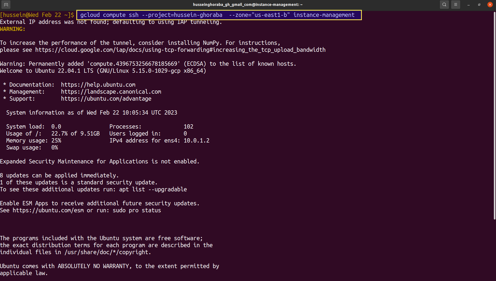
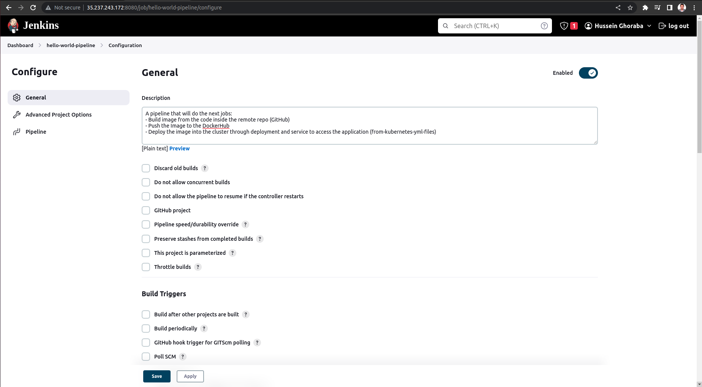

# $${\color{blue}GCP-Infrastructure-of-Final-ITI-Project}$$	
## A brief about the infrastructure of the project:
**Infrastructure of the project will be deployed using `Terraform files` and will create resources as following:**

***1-`VPC` with name `vpc-main` that contains: `management-Subnet` and `restricted-subnet`***

***2-`management-subnet` contains: `VM-Instance` private which allowed to be accessed only from IAP with name `instance-management` and `Cloud NAT` with name `management-nat`***

***3-`restricted-subnet` contains: a private `GKE-Cluster` that will have the deployment of `Jenkins` "main pod master-node" and `Jenkins-slave-pod` "worker pod worker-node in Jenkins"`***

**By using `Jenkins` and his nodes it will trigger the GitHub repo. of the development team and with pipeline it will automate the process of `Building Image` and `Pushing it` to DockerHub Repository & Automatically create `deployment` & service `load-balancer-svc` in the `GKE-Cluster`**   

**The next photo shows the required infrastructure that will be deployed and what is the project lifecycle:**


###                ______________________________________________________________________________________________


> ## Follow the next steps to run this project:

## Pre-Requests:

**Follow the steps inside each link from the following to finish the pre-requests:**

> 1- GCP-Project 
```
https://cloud.google.com/resource-manager/docs/creating-managing-projects 
```
> 2- gcloud sdk on your local machine 
```
https://cloud.google.com/sdk/docs/install
```
> 3- Install Docker in your local machine
```
https://docs.docker.com/engine/install
```
> 5- Configure Docker on your local machine with cloud SDK 
```
https://cloud.google.com/container-registry/docs/advanced-authentication
```
> 6- Terraform setup on you local machine
```
https://developer.hashicorp.com/terraform/tutorials/aws-get-started/install-cli 
```
> 7- install git on your local machine
```
https://github.com/git-guides/install-git
```
### --------------------------------------------------
### 1- Creating the infrastructure of the project on GCP:

> 1- In a new directory use the next command in the bash shell to download the files from this repo
```
git clone git@github.com:HusseinGhoarba/GCP-Project.git
```
> 2- Open file `terraform-files` and edit on files `terraform.tfvars` values of : 
	
	2-1- `user-project-id` --> add  `<your-project-id>`
	
	2-2- `user-region`     --> add  `<your-prefered-region>`
	
	2-3- `user-zone`       --> add  `<your-prefered-zone>`
	
     Open file `user-data.sh` and edit the value of the zone inside the line `no.25` with your `<your-prefered-zone>`

> 3- run the following commands as follows:
```
terraform init
```
screenshot from the command:


```
terraform plan
```
screenshot from the command:


```
terraform apply
```
screenshot from the command:


```
yes
```


### --------------------------------------------------
### 2- Building Docker-Image and Push it:

> 1- change your directory to the directory `jenkins-slave` which is inside the downloaded directory and run the following command in your terminal after changing `<your-project-id>` with yours:
```
docker build . -t gcr.io/<your-project-id>/jenkins-slave
```
screenshot from the command:


> 2- Push the created image by the following command to your container registry of your google cloud project after changing `<your-project-id>` with yours:
```
docker push gcr.io/<your-project-id>/jenkins-slave:latest
```
screenshot from the command:


### --------------------------------------------------
### 3- Deploy the Jenkins into the cluster using the private vm:
**"General Hint: make sure to replace the `<your-project-id>` with yours and replace the `<your-preferred-zone>` with yours"**
> 1- Connect to the private-instance which is in the management-subent: 
```
gcloud compute ssh --project=<your-project-id>  --zone=<your-added-preferred-zone> instance-management
```
screenshot from the command:



> 2- Download the files of the repo. using git:
```
git clone https://github.com/HusseinGhoarba/FP-Infrastructure-GCP.git
```
screenshot from the command:


> 3- checking the version of helm which is installed in the script of the vm `metadata-script.sh` file
```
helm version
```
screenshot from the command:


> 4- connect to the cluster:
```
gcloud container clusters get-credentials python-cluster --zone <your-added-preferred-zone> --project <your-project-id>
```
screenshot from the command:


> 5- create namespace with name <jenkins> to add the jenkins deployment and services into it
```
kubectl create ns jenkins
```
screenshot from the command:


> 7- Let's install deployment jenkins using helm in the python-cluster in name-space jenkins
```
helm install jenkins ./FP-Infrastructure-GCP/jenkins-hg/
```
screenshot from the command:


> 8- make sure that the service changed through the next command:
```
kubectl get svc -n jenkins 
```
screenshot from the command:


> 9- try to access the jenkins server:

**1- get the `<External-IP>`:`<Port>` as follows:**


**2- write it in any web-browser:**


> 10-  After Opening it will ask for a the initial password which we will get from: 

**10/1- get the name of the pod from the next command:**
```
kubectl get po -n jenkins 
```
screenshot from the command:


**10/2- get the exec to the pod from the next command after changing the `<pod-name>` by what we get from the last command:**
```
kubectl exec --stdin --tty <pod-name> -n jenkins -- /bin/bash 
```
screenshot from the command:


**10/3- Let's go to the path whci indicated in the server of the jenkins and show the file from the following command:**


```
cat /var/jenkins_home/secrets/initialAdminPassword
```


**10/4- Let's enter to the jenkins-server by copying the output password and add it into the server:**


**10/5- then install suggested plugins and add your user-name and password then welcome to Jenkin**


### --------------------------------------------------
### 3- Deploy the Jenkins-Slave-Pod into the cluster using the private vm:

**HINT: before applying the yaml files do the following steps:**

> 1- execute the following command:

```
vi ./FP-Infrastructure-GCP/jenkins-slave/slave-deploy.yml 
```
and change line 25 the old content `<gcr.io/hussein-ghoraba/jenkins-slave>` the new content after adding your project-id `<gcr.io/<your-project-id>/jenkins-slave>`

> 2- let's create the deployment files of the slave pod:
```
kubectl apply -f ./FP-Infrastructure-GCP/jenkins-slave -n jenkins
```
screenshot from the command:


> 3- make sure that the jenkins-slave-pod is running:
```
kubectl get po -n jenkins
```
screenshot from the command:


### --------------------------------------------------
### 4- Configure the manage nodes inside the jenkins server to add the jenkins slave pod:

> 1- Open Jenkins Server and go to `manage jenkins` then go to `Manage Credentials` and then click on `global`

>> 1-1 Choose `+ Add Credentials` on the top left

>> 1-2 in section of `Kind`
```
Choose: Username with Password
```
>>1-3 in section of `Scope`
```
Choose: Global (Jenkins, nodes, item, ....)
```
>>1-4 	in section of `Username` the same username inside the dockerfile which we built for the slave
```
jenkins
```
>>1-5 in section of `Password`
```
123456
```
>>1-6 in section of `ID` add the name which you will use it in jenkins
```
slave-user
```
>>1-7 Then click on `Create`


> 2- Open Jenkins Server and go to `manage jenkins` then go to `manage nodes and clouds` and then click on `add new node`


 
> 3- Follow the next steps with the same name:

>>3-1 in section of `Remote root directory`
```
/var/jenkins_home
```
>>3-2 in section of `Labels`
```
jenkins-slave
```
>>3-3 in section of `Launch method`
```
Choose: Launch Agent via SSH
```
>>3-4 in section of `Host` "add the name of the service of jenkins-slave-pod -- oly add the next name as it's the name of service used in the k8s files of slave-pod":
```
jenkins-slave-svc
```
>>3-5 in section of `Credentials`:
```
Choose: the created credentials which we created in section-1 "jenkins/******"
```
>>3-6 in section of `Host Key Verification Strategy`
```
Choose: Non verifying Vertification Strategy
```
>> any other un-mentioned section do-not do anything with it ... 

>>3-7 Then click on `Save`


> 4- Some configuration we will do in the opened terminal `-that have VM opened in SSH-` to do to complete the Launching of the new node:

**HINT: If you closed the terminal do this command after changing the values <inside-this>:  `gcloud compute ssh --project=<your-project-id>  --zone=<your-added-preferred-zone> instance-management`**
>>4-1 Get the name of the pod:
```
kubectl get po -n jenkins
```
screenshot from the command:


>>4-2 Connect to the slave-pod:
```
kubectl exec --stdin --tty <pod-name> -n jenkins -- /bin/bash 
```
screenshot from the command:


>>4-3 Do the following commands:
- open ssh service
```
service ssh start
```
- change password of the jenkins user:
```
passwd jenkins
```
--> In Enter new UNIX password: `123456` "the same password we add in the credentials" and re-type it 
- change the owner user and owner group of the docker.soc file "to be able to build images"
```
chown jenkins:jenkins /var/run/docker.soc
```


>>4-3 Go Back to the Jenkins Server as we were on the node `jenkins-slave-node` and go to `Status` then click on the button `Launch`


### --------------------------------------------------
### 5- Finally we are in the final step in which we will create `pipeline` which will auto `Build&Deploy` the code inside the application repo:
> 1- Add credentials od the DockerHub into Jenkins server : 06-create-credentials-of-dockerHub

>> 1-1 The same steps of creating credentials of jenkins-user but here you should add your username and password of dockerhub account:
>>> go to `manage jenkins` - `manage credentials` - `global` then `+ Add new credentials` and choose `Username and password credentials` and fullfill the requires as i explained before 


> 2- Configure the pod to deploy pods in the cluster:

>> 2-1 go to the terminal in which the VM-Instance is opened and get into the terminal of the jenkins-slave-pod:
```
su jenkins
```
>> 2-2 add this command 
```
gcloud container clusters get-credentials <your-cluster-name> --zone <your-entered-prefered-zone> --project <your-project-id>
```

> 3- Create an Item "Pipeline" from the jenkins server as follow:


>> 3-1- in section `Description` ------`"Optional"`
```
A pipeline that will do the next jobs:
- Build image from the code inside the remote repo (GitHub) 
- Push the Image to the GCR
- Deploy the image into the cluster through deployment and service to access the application (from-kubernetes-yml-files)
```
>> 3-2- in section `Pipeline`
>>> 3-2-1- in section `Definition`:
```
Choose: Pipeline script from SCM
```
>>> 3-2-2- in section `SCM` 
```
Choose: Git
```
>>>> 3-2-2-1- in section `Repository URL`:
```
<Add link of your repository> -- for me i added this as this has the requirements of the project <https://github.com/HusseinGhoarba/FP-Application-GCP>
```
>>>> 3-2-2-1- in section `Branches to build`:
```
<add the name of the branch that has your application> -- in my case <./main>
```
>>> 3-2-3- in section `Script Path`
```
<add the name of your script file> but it's common to use the name of the script file as "Jenkinsfile" and that what i use.
```
>> Any other un-mentioned sections  let it as its' default case

>> Last thing click on button `Save`




### --------------------------------------------------
### Finally: 
***I want to THANK YOU & If there is any problem don't hesitate to send to me***
### --------------------------------------------------
### Project Contributers:
||
|:-----------------:|
|[Hussein Ghoraba](https://github.com/HusseinGhoarba)|
